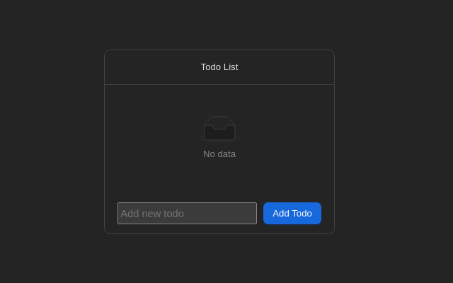
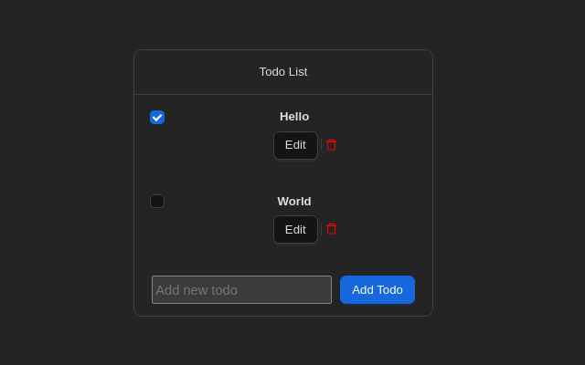

# Todo list

## Description

This is a simple fullstack web application of todo list

## Technology Stack

- React
- Vite
- Node.js
- Fastify
- PostgreSQL

## Installation

### Prerequisites

Make sure you have installed the follow prerequisites

- Node.js (LTS): Download from [official site](https://nodejs.org/)
- Docker: Follow the document - [Get Docker](https://docs.docker.com/get-docker/)

### Setup

```sh
docker compose build --parallel
```

## Usage

To start everything, run the commadn locally:

```sh
docker-compose up -d
```

Optional starting method:

```sh
docker-compose up [server | client] -d
```

## Features

## API Documentation

Start the server app and visit http://localhost:9080/documentation/

## Configuration

There is a `.env.sample` for sample configuration, simply copy to or rename it as `.env` if you want to run locally

## Testing

Go to each server/ and client/ and run:

```sh
pnpm run test
```

## Deployment

For production deployment, it require setup of a complete pipeline for the production build and deployment.
Here I will given an example of how to deploy this app with AWS as provider, given that the infrastructure is ready

The client can be built and update to S3 and serve with AWS Cloudfront.
The server can be built for production and then host it on any cloud service, such as AWS ECS.

### Web

1. Build the artifact`

    ```sh
    pnpm run build
    ```

2. Upload to AWS S3 bucket

### Server

1. Build the image

    ```sh
    docker buildx build
    --tag api
    --target prod
    --build-arg PORT=9080
    --build-arg HOSTNAME=0.0.0.0
    ./server
    ```

2. Push it to AWS ECR

3. Deploy with AWS ECS

## Credits and Acknowledgments

The client testing can be enhanced by using Cypress or other testing framework, currently on reducer is tested because it may requires too much extra time to test / mock with the current client/api setup

The database is initialized on creation as the requirement is not to use any ORM.
Assuming for future maintenance like migration, ORM (i.e Drizzle, Prisma, etc.) will be needed

## Troubleshoot

If the database cannot be init, it can because `script/db/init.sh` is missing require permission.The solution is to remove the entire docker container and volume, grant permission to init script `chmod +x script/db/init.sh` and then re-build and start the app

## Screenshots/Demo



